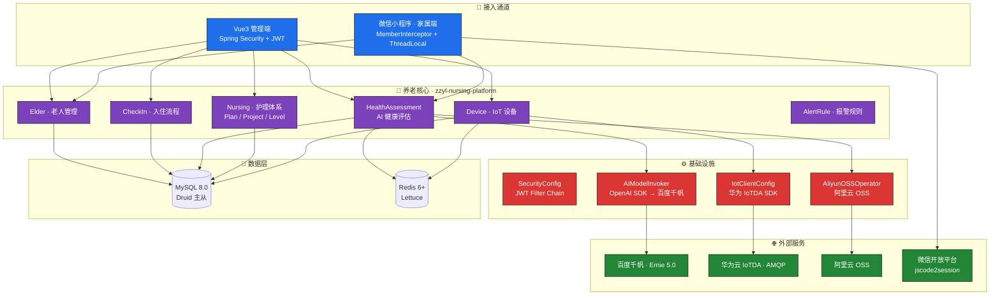

# 🏥 ZZ Nursing — 智颐智慧养老护理平台

<div align="center">


**全生命周期智慧养老管理平台 — AI 健康评估 · 华为 IoTDA 设备监控 · Vue3 + 微信小程序双通道**

</div>

---

## 🎯 一句话说清楚

> 基于 RuoYi-Vue 企业底座，集成 **百度千帆 AI**（健康评估）、**华为云 IoTDA**（物联网设备）、**阿里云 OSS**（PDF 存储）的专业养老护理管理平台。管理端 Vue3 供养老机构运营，微信小程序供家属实时查看老人状态。

---

## 🧠 系统架构



---

## 🏥 核心功能

### 🩺 AI 智能健康评估

```
体检 PDF 上传
    ↓
阿里云 OSS 存储（生成 URL）
    ↓
PDFUtil 提取文本（Apache PDFBox）
    ↓
Redis 缓存 24h（避免重复解析）
    ↓
AIModelInvoker.qianfanInvoker()
    ↓
OpenAI 兼容 SDK → 百度千帆 Ernie 5.0
    ↓
结构化 JSON 返回:
  · 健康综合评分 (0-100)
  · 风险等级（低/中/高/危）
  · 8 大系统评分（心血管/呼吸/消化/神经/泌尿/内分泌/骨骼/五官）
  · 每项异常指标的解读 + 干预建议
  · 推荐护理等级（一级~四级/特级）
```

**效果：** 从上传 PDF 到生成报告全自动，经 Redis 缓存后单个评估从 ~8s 降至 ~1s。

---

### 📡 华为云 IoTDA 设备监控

| 功能 | 实现 |
|------|------|
| **产品同步** | 从华为 IoTDA 拉取产品列表 → Redis 缓存 |
| **设备注册** | 通过 IoTDA SDK 注册设备到平台 |
| **设备绑定** | 绑定设备到 楼层-房间-床位 物理位置 |
| **数据消费** | Apache Qpid JMS AMQP 客户端消费设备上报数据 |
| **数据存储** | 批量写入 `device_data` 表 + Redis Hash 设备影子缓存 |
| **设备类型** | 可穿戴设备（手表/手环）+ 固定设备（床头监测仪） |

---

### 🧓 全生命周期管理

```
入住申请 → 老人建档 → 健康评估 → 护理等级分配
    → 护理计划制定 → 护理项目排期 → 合同签署
    → 日常照护 → 报警规则监控 → 退住办理
```

| 模块 | 功能 | 核心数据 |
|------|------|---------|
| **Elder** | 老人基本信息管理 | 姓名、身份证、生日、地址、身份证照片、床位绑定 |
| **CheckIn** | 入住申请与审批 | 老人信息 + 合同 + 床位分配，状态流转 |
| **Nursing Level** | 护理等级体系 | 等级名称、费用、关联护理计划 |
| **Nursing Plan** | 护理计划模板 | 计划名称、排序、状态 |
| **Nursing Project** | 护理项目清单 | 项目名、单位、单价、执行频次 |
| **Contract** | 合同管理 | 合同文件、日期、1:1 关联老人 |
| **AlertRule** | 报警规则 | 设备阈值 / 老人异常指标 / 操作符 / 阈值 |
| **Bed/Room/Floor** | 设施管理 | 楼层 → 房间 → 床位三级结构 |

---

## 📱 双通道应用架构

| 端 | 技术 | 用户 | 认证 |
|----|------|------|------|
| **管理端** | Vue 3 + Element Plus 2.7 + Vite | 养老机构运营人员 | Spring Security + JWT Filter |
| **家属端** | 微信原生小程序 | 老人家属 | WeChat `jscode2session` → openId → JWT |

家属端通过 `MemberInterceptor` 拦截 `/member/**` 路径，解析 JWT 后设置 `UserThreadLocal`（ThreadLocal 实现线程安全的用户上下文），与管理端的 Spring Security 认证体系完全解耦。

---

## ⚙️ RuoYi 企业基础能力

基于 RuoYi-Vue 3.8.9，继承全部企业级特性：

- **RBAC 权限**：用户 → 角色 → 菜单/部门，支持数据权限粒度控制
- **代码生成器**：数据库表 → 一键生成 Controller/Service/Mapper/Vue 页面
- **Quartz 定时任务**：合同到期提醒、设备离线检查
- **Druid 主从**：读写分离，连接池监控
- **Jenkins CI/CD**：`Jenkinsfile` 持续集成
- **系统监控**：服务器 CPU/内存/磁盘（OSHI）、在线用户、操作日志、缓存监控

---

## 🏗️ 技术栈

| 层级 | 技术选型 |
|------|---------|
| **运行时** | Java 11 · Spring Boot 2.5.15 |
| **安全** | Spring Security 5.7 · JWT 0.9.1 |
| **ORM / DB** | MyBatis-Plus 3.5.2 · MySQL 8.0（Druid 连接池 + 主从） |
| **缓存** | Redis 6+（Lettuce + Fastjson2 序列化） |
| **AI** | 百度千帆 Ernie 5.0（OpenAI 兼容 SDK `openai-java` 2.8.1） |
| **IoT** | 华为云 IoTDA SDK + Apache Qpid JMS AMQP |
| **OSS** | 阿里云 OSS |
| **WeChat** | 微信小程序 API · `jscode2session` · `getuserphonenumber` |
| **前端** | Vue 3 + Element Plus 2.7 + Vite · 微信原生小程序 |
| **定时** | Quartz |
| **构建** | Maven + Jenkins + Docker |

---

## 🚀 快速启动

```bash
git clone https://github.com/1byteone/zznursing.git
cd zznursing

# 初始化数据库
mysql -u root -p < sql/zzyl.sql

# 配置 application-druid.yml（数据库连接、Redis、华为 IoTDA、百度千帆、阿里云 OSS）

# 启动后端
mvn clean package -DskipTests
java -jar zzyl-admin/target/zzyl-admin.jar

# 启动前端（管理端）
cd zzyl-ui
npm install && npm run dev

# 访问
# 管理端: http://localhost
# 微信小程序: /pages/index/index
```

---

## 📂 项目结构

```
zznursing/
├── zzyl-admin/              # 🚪 启动入口 + Web Controller（REST）
├── zzyl-nursing-platform/   # 🏥 养老核心业务（Elder / CheckIn / HealthAssessment / Nursing / Device / Alert）
├── zzyl-system/              # 👥 系统管理（用户 / 角色 / 菜单 / 部门 / 字典 / 配置）
├── zzyl-framework/           # ⚙️ 框架层（SecurityConfig / IotClientConfig / RedisConfig / 全局异常 / 拦截器）
├── zzyl-common/              # 🔧 公共模块（AI 调用器 / PDF 解析 / Excel / 枚举 / ThreadLocal）
├── zzyl-oss/                 # ☁️ 阿里云 OSS 操作封装
├── zzyl-quartz/              # ⏰ 定时任务
├── zzyl-generator/           # 🎨 代码生成器
└── zzyl-ui/                  # 🎨 Vue 3 + Element Plus 管理端前端
```

---

## 📄 License

[MIT](LICENSE) © 1byteone
